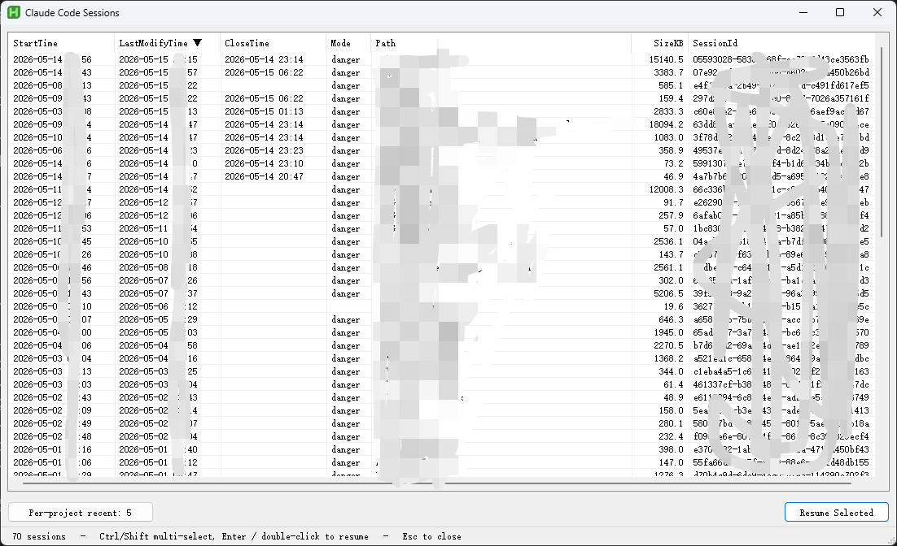

# claude-picker

*English | [中文](#中文)*



A Windows system-tray tool that relaunches recently-closed
[Claude Code](https://claude.com/claude-code) sessions in Windows Terminal.

It watches `claude.exe` processes in the background; the picker lists your
past sessions and reopens any of them in a new `wt` tab — restoring the
working directory, session id, and `--dangerously-skip-permissions` flag.

A single ~12 KB [AutoHotkey v2](https://www.autohotkey.com/) script.

## Requirements

- Windows 10/11, 64-bit
- Windows Terminal (`wt.exe`)
- [AutoHotkey v2](https://www.autohotkey.com/) — only to run the `.ahk`
  script or build the exe; the prebuilt `claude-picker.exe` needs nothing.

## Install

**Double-click `claude-picker.exe`** to start it. The watcher goes into the
system tray and the picker pops up. If it is already running, double-clicking
the exe just brings its picker to the front (single-instance, no duplicates).

Right-click the tray icon to toggle **Start on login**, or pick **Quit** to
stop it.

To run from source instead, launch `claude-picker.ahk` with AutoHotkey v2.

## Usage

- **Left-click** the tray icon — open the picker.
- **Double-click a row** / **Enter** — resume the selected session(s).
  `Ctrl`/`Shift`-click to pick several and resume them as a batch.
- Click a column header to sort. **Per-project recent** caps how many
  recent sessions show per project.
- **Esc** — hide the picker; the watcher keeps running.

## Build

```powershell
& "C:\Program Files\AutoHotkey\Compiler\Ahk2Exe.exe" /in claude-picker.ahk /out claude-picker.exe /base "$env:LOCALAPPDATA\Programs\AutoHotkey\v2\AutoHotkey64.exe"
```

The exe is unsigned, so Windows SmartScreen warns once on first run —
**More info → Run anyway**.

## License

[MIT](LICENSE)

---

# 中文


一个 Windows 系统托盘小工具,在 Windows Terminal 里重新拉起最近关闭的
[Claude Code](https://claude.com/claude-code) 会话。

它在后台监视 `claude.exe` 进程;picker 列出历史会话,可在新的 `wt` 标签页
重开任意一个——自动恢复工作目录、会话 id 以及 `--dangerously-skip-permissions` 标志。

一个约 12 KB 的 [AutoHotkey v2](https://www.autohotkey.com/) 脚本。

## 环境要求

- Windows 10/11,64 位
- Windows Terminal (`wt.exe`)
- [AutoHotkey v2](https://www.autohotkey.com/) — 仅在运行 `.ahk` 脚本或
  编译 exe 时需要;预编译的 `claude-picker.exe` 无需任何依赖。

## 安装

**双击 `claude-picker.exe`** 即可启动:watcher 进入系统托盘,picker 窗口
随即弹出。如果实例已在运行,双击 exe 不会再开一个,只把已运行实例的
picker 调到前台(单实例,不会重复)。

右键托盘图标,勾选 **Start on login** 开机自启,或点 **Quit** 退出程序。

想跑源码而非 exe,用 AutoHotkey v2 启动 `claude-picker.ahk` 即可。

## 用法

- **左键单击**托盘图标 — 打开 picker。
- **双击一行** / **回车** — 恢复选中的会话。`Ctrl`/`Shift` 点选多个可批量恢复。
- 点列头排序。**Per-project recent** 设定每个工程显示最近几个会话。
- **Esc** — 隐藏 picker;watcher 继续后台运行。

## 编译

```powershell
& "C:\Program Files\AutoHotkey\Compiler\Ahk2Exe.exe" /in claude-picker.ahk /out claude-picker.exe /base "$env:LOCALAPPDATA\Programs\AutoHotkey\v2\AutoHotkey64.exe"
```

exe 无代码签名,首次运行 Windows SmartScreen 会提示一次 —
**更多信息 → 仍要运行**。

## 许可

[MIT](LICENSE)
